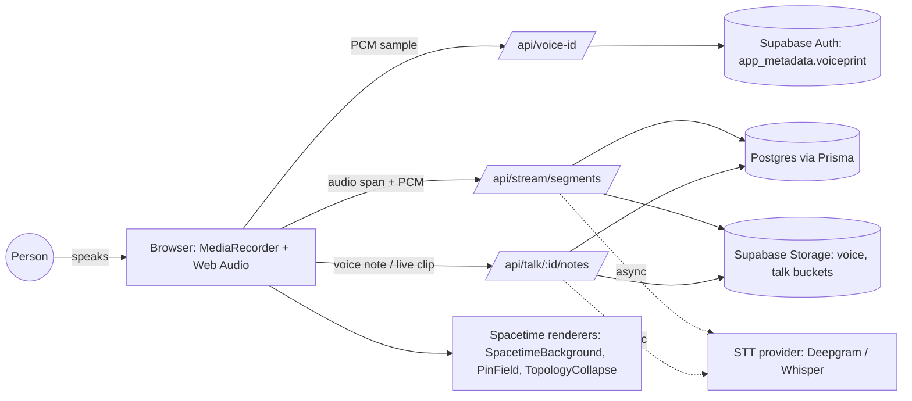
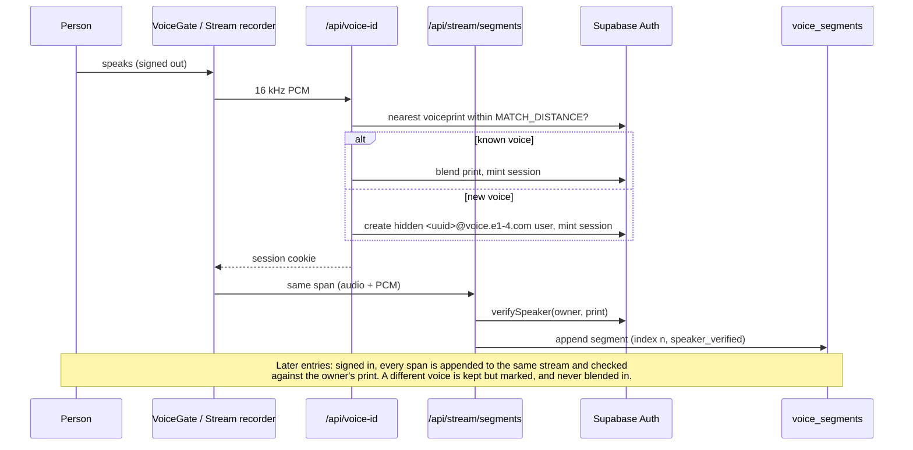
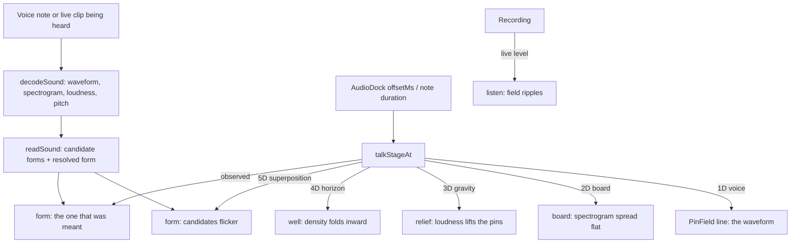
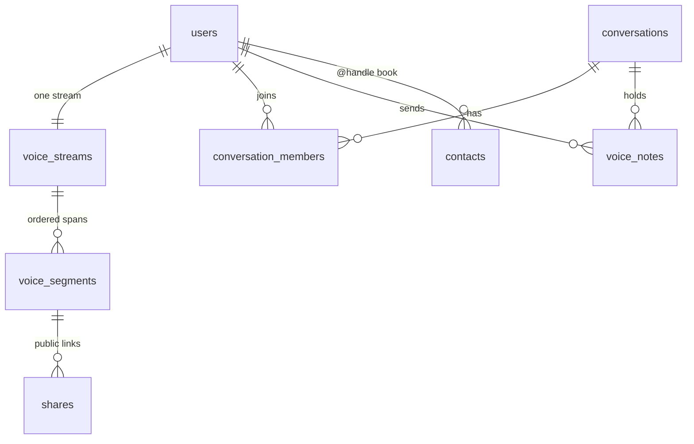
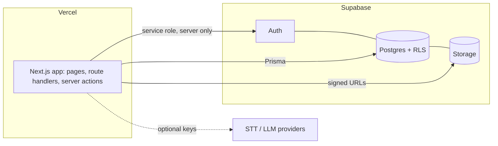

# e1-4.com architecture

Voice in, spacetime out. Nothing on screen is typed or read: people are voices, conversations are
fields, and the words (transcripts) stay in the data layer for search, export and screen readers.

## System context

## Voice identity and the 1D stream

Every entry is voice-checked; the first one also opens the door.

- One `voice_streams` row per user; `voice_segments` are ordered by `(stream_id, index)`.
- `speaker_verified`: `true` matched the owner's print, `false` another voice, `null` too short
  (< 1.5 s) or not checked.
- A mismatched sample never updates the stored print, so another voice can't drift an account.

## Talk: 1D to 5D over a conversation

- The thread is voices only: avatars, waveform glyphs sized by duration, live rings, icon controls.
  Transcripts are rendered `sr-only`.
- The stages reuse the personal journey's proportions (`lib/journey.ts`), spread across the note's
  length with at least `MIN_STAGE_MS` each.
- 3D is a real WebGL scene; 4D (time as depth/density) and 5D (superposed interpretations) are
  projections into it, not literal higher-dimensional renders.
- `SpacetimeBackground` stays behind every page (fixed, `pointer-events: none`) and only reads the
  level of a recording already in progress; it never opens the microphone.

## Data model (voice parts)

Hard delete (`lib/privacy/hard-delete.ts`) removes rows and storage objects for all of the above;
the export includes every segment with its `speaker_verified` flag.

## Deployment boundary

## Known limits

- Voiceprint matching scans every stored print; it needs an index (or a provider) before scale.
- No liveness / anti-clone check yet: a good recording or clone of someone could open their stream.
- Talk polls while open; no push, no WebRTC.
